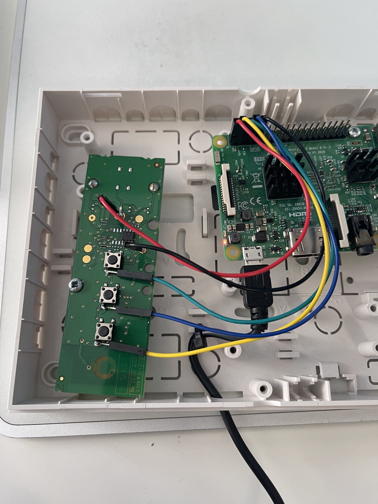
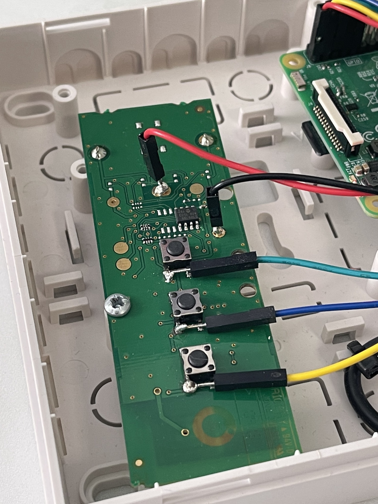
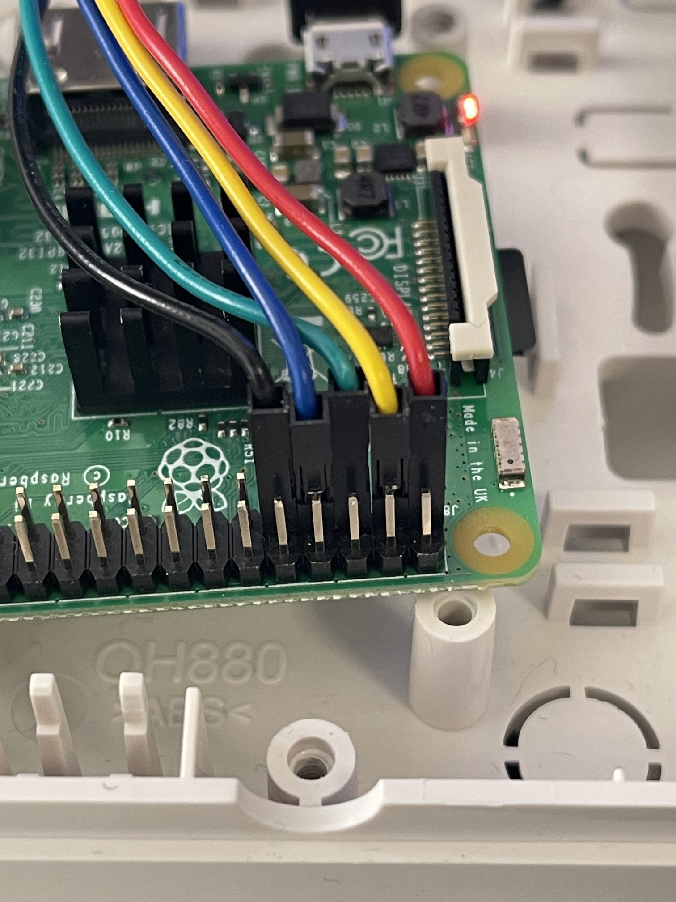

[](https://badge.fury.io/js/homebridge-somfy-hotwired)
[](http://unlicense.org/)
[](https://github.com/homebridge/homebridge/wiki/Verified-Plugins)
# homebridge-somfy-hotwired
If you have a Somfy Telis 1 RTS you can wire it your Raspberry Pi and control all of the buttons remotely. Since it 
requires soldering and some cables, I like to call it hotwiring your Somfy :).

You do need a remote that is already programmed to work with your shutter.

## Hotwiring
Simplest would be if you have a case to put the board of the remote it.
1. Remove the casing and battery
2. Get 5 jumpwires (female to male)
3. I like to use pins 1 and 9 for the power
4. So you can use 3, 5 and 7 for the `up`, `my` and `down` button
5. Solder all of these male ends to the board and plug the female side onto te GPIO

It should look somewhat like this:




No you are ready to go, either use the UI config or add the config manually.

## Config
Sample of the config used in the README. Movement duration is best measured as the time it takes to move from up to 
`MySomfy` position in seconds, you can adjust it to your liking. 

```json
{
    "name": "Shutter",
    "pin_up": "3",
    "pin_down": "5",
    "pin_my_position": "7",
    "movement_duration": "11",
    "accessory": "Homebridge-somfy-hotwired"
}
```
